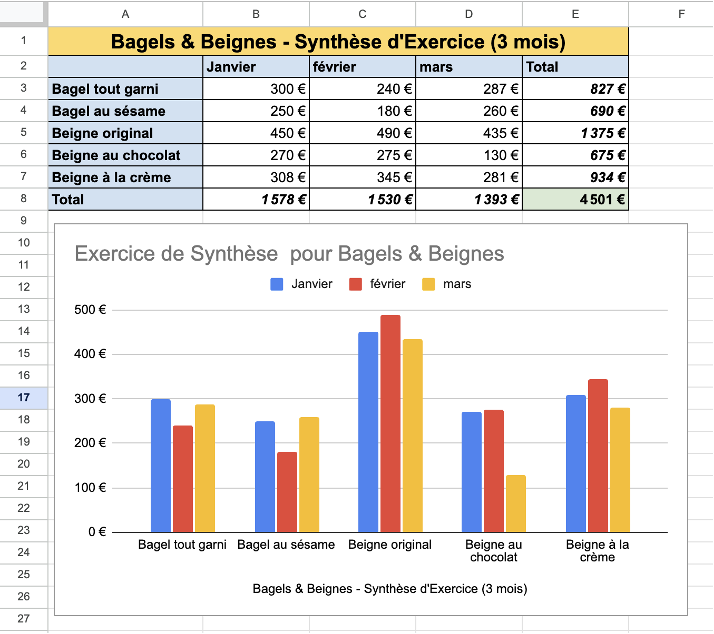

# ATELIER BLOC 1 
Les exercices sont à faire **en classe**, **en équipe de deux**.

Vous pouvez utiliser **Internet pour des recherches complémentaires** et consulter les notes du cours. En revanche, tout **usage d’outils d’intelligence artificielle est strictement interdit**. Les **téléphones cellulaires doivent rester rangés** pendant toute la durée de l’atelier.

Lorsque vous aurez terminé, **suivez les instructions de remise indiquées au bas de la page**. 

L'atelier est **noté** et vaut **5 % de la session** ; 
tout non-respect des règles ci-dessus entraînera un **zéro automatique**.

### Exercice 1 : documentation adéquate
Vous travaillez au centre de services TI. Deux demandes arrivent par courriel/Teams.
Votre mission est de transformer du texte “roman” en notes d’incident claires et utiles.

Vous occupez un poste dans un centre de service TI, et vous recevez **deux demandes** par courriel/teams de personnes sollicitant votre aide. À partir de ceux-ci, **extrayez l’information utile** et **rédigez des notes d’incident claires et utiles** selon les consignes suivantes.  

- Lisez le brouillon puis rayez les infos non pertinentes (utilisez ~~texte~~ dans votre réponse).
- Notez les **faits** et **symptômes** (infos vérifiables/observables).
- Listez les **actions** tentées (une action → un résultat).
- Écartez les **présomptions** et écrivez vos **déductions** (raisonnement basé sur les faits ; pas d'opinions, "on pense que…", éléments non vérifié).
  
Enfin, **classifiez** le billet et justifiez votre raisonnement en spécifiant :
  - **catégorie / sous-catégorie** 
  - la **priorité** (selon impact & urgence).
  - le **niveau de traitement** (N1/N2/N3) 

**Objectif** : laisser des traces exploitables par un·e autre technicien·ne.

##### CAS A : Ordinateur en panne 
> Allo. Je vous écris au sujet de mon ordinateur, depuis ce matin il refuse catégoriquement de fonctionner normalement. Quand je l’allume, il fait un bruit bizarre comme un petit "vroum" qui s’arrête, puis plus rien. L’écran reste noir, mais le petit témoin lumineux en bas à droite de l’écran clignote trois fois, puis fait une pause, et recommence. Peut-être que c’est un message codé ?
J’ai essayé de redémarrer plusieurs fois, en appuyant sur le bouton (pas trop fort, je vous rassure !), mais toujours rien. J’ai même débranché la prise pendant que je prenais mon café au lait au 4e étage (la machine à café là-bas est bien meilleure).
Il faut savoir que vendredi soir, juste avant de partir, j’ai renversé un peu d’eau gazeuse sur le coin de mon bureau, mais je pense que ça n’a rien à voir : j’ai bien essuyé avec une serviette en papier.
J’ai aussi changé l’écran avec celui de mon collègue Damien pour voir si le problème venait de là. Le sien fonctionne bien sur sa machine, mais pas sur la mienne. D’ailleurs, Damien m’a dit que je devrais "appeler les gens de l’informatique" — me voilà donc.
Pour info, c’est un PC fixe Dell, le modèle… euh… c’est écrit derrière mais j’ai pas osé le bouger, il est un peu lourd. Et aussi, parfois l’ordinateur fait un bip avant de s’éteindre de lui-même. Très énervant.
Merci d’avance ! J’ai besoin de mon ordi pour envoyer des rapports ultra importants à la direction régionale. 😅
Martine

--- 

##### CAS B : Impression difficile 
> Bonjour,
J’ai un souci avec l’imprimante de mon bureau depuis ce matin. Quand je lance une impression, soit ça met un temps fou, soit rien ne sort. Parfois ça imprime, mais ce n’est pas le bon format, ou tout est décalé à droite comme si la mise en page était cassée.
J’ai bien sélectionné l’imprimante HP habituelle, celle qu’on utilise depuis toujours ici. Elle est en couleur, posée sur la table à côté du bureau de Céline, juste à côté du panneau "Ne pas laisser de documents confidentiels".
D’habitude elle imprime sans souci, même les gros fichiers PDF. Mais là, j’ai essayé d’imprimer un bulletin de paie et j’ai eu un truc totalement illisible, genre des symboles bizarres ou des caractères japonais…
J’ai redémarré mon ordinateur, j’ai aussi relancé l’impression en changeant de document (un Excel et un PowerPoint), mais le résultat est toujours aléatoire.
Céline m’a dit "peut-être qu’il faut réinstaller le pilote", mais moi je ne touche pas à ça, j’ai peur de tout casser.
Merci de voir ce qui se passe, on a besoin d’imprimer des documents RH aujourd’hui pour la direction.

> Informations techniques (outil de gestion à distance)
    •    Nom du poste : SMOREAU-LP
    •    OS : Windows 10 Pro
    •    Adresse IP : 192.168.23.129
    •    Imprimante par défaut : Kyocera_TA-M5526cdw_1A12
    •    Pilote : KX Universal v8.2 (installé 10/09/2025)
    •    Statut de l’imprimante : Connectée – Pas de bourrage – En attente
    •    Dernier document imprimé : "BULLETIN_Paie_Sep25.pdf" – terminé avec erreur
    •    Autres imprimantes installées :
    ◦    HP_OpenSpace2
    ◦    PDF Creator
    ◦    Fax_Machine

### Exercice 2 : rédaction de procédure (courriel de support)
Un utilisateur **novice** avec le **logiciel excel** vous demande de l’aider à reproduire la grille ci-dessous (tableau avec totaux + graphique en colonnes). 

Vous devez devez **rédiger un courriel de support** clair et concis afin de guider l’utilisateur **pas à pas** jusqu’au même résultat, avec références à la **documentation officielle** : https://support.microsoft.com/fr-fr/excel. 

### À remettre
Un seul **courriel par équipe** envoyé à : sara.aissat@cegepmv.ca.

Objet recommandé : 420-510 – Atelier B1

Le **corps du message** doit contenir votre **réponse complète à l’exercice 2** (le courriel de support rédigé).
À cela vous devez joindre le **document de l’exercice 1** en **pièce jointe** (assurez vous que vos prénoms figurent sur le nom du fichier).

Effectuez l'envoie depuis l’**adresse de l’un des deux étudiants**, et mettre le **second étudiant en CC** (obligatoire). 

Échéance : envoi avant la fin de l’atelier (sauf indication contraire en classe).

